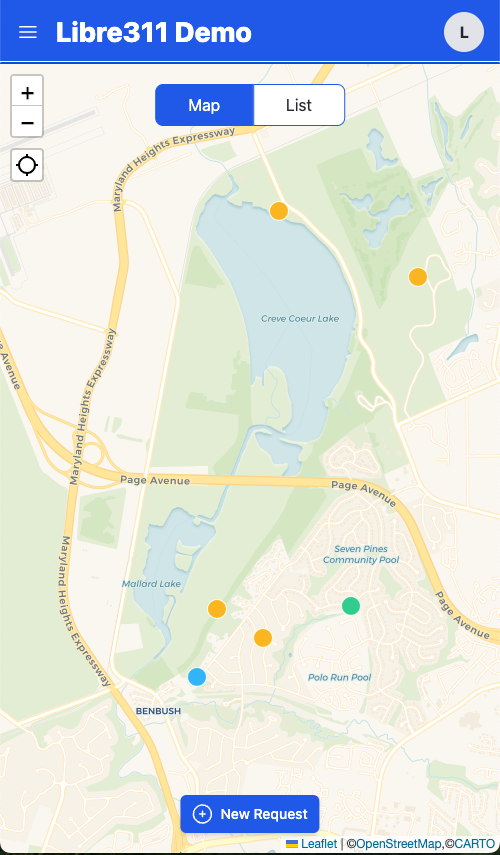
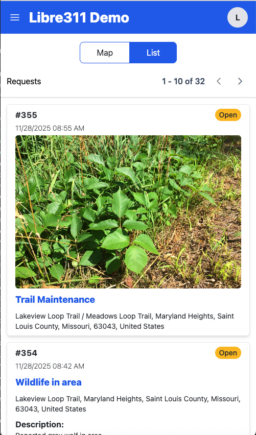
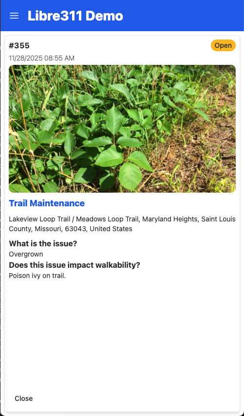
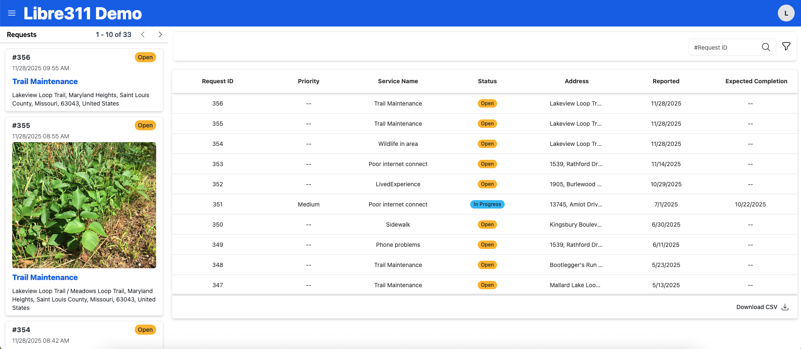
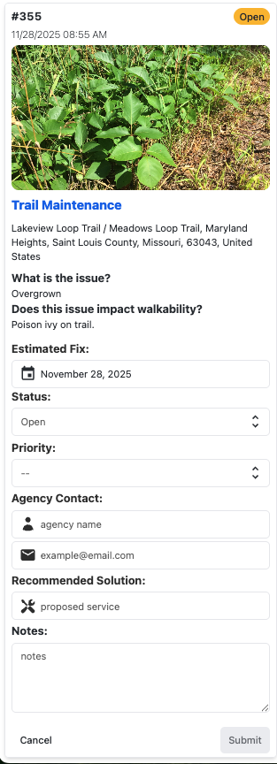

# Libre311 Users Guide

## Table of Contents

- [Introduction](#introduction)
- [Getting Started](#getting-started)
- [Public User Guide](#public-user-guide)
  - [Browsing Service Requests](#browsing-service-requests)
  - [Creating a Service Request](#creating-a-service-request)
  - [Searching and Filtering](#searching-and-filtering)
- [Administrator Guide](#administrator-guide)
  - [Logging In](#logging-in)
  - [Managing Service Requests](#managing-service-requests)
  - [Configuring Service Definitions](#configuring-service-definitions)
- [Mobile Experience](#mobile-experience)
- [Accessibility](#accessibility)
- [Troubleshooting](#troubleshooting)

---

## Introduction

Libre311 is a mobile-friendly web application that implements the Open311 standard for civic service requests. It enables communities to report and track non-emergency issues such as potholes, graffiti, streetlight outages, and other municipal services. It is designed to enable administrators to define custome service types and to provide basic service request management capabilities.

### What is Open311?

Open311 is a standardized protocol for civic issue tracking. Libre311 implements the [Open311 GeoReport v2 API](https://wiki.open311.org/GeoReport_v2/), making service request data accessible and interoperable with other civic technology tools.

### Key Features

- **No account required** for public users to browse and submit service requests
- **Mobile-friendly** interface optimized for smartphones and tablets
- **Map-based** visualization of service requests
- **Multi-format views** including list, map, and table layouts
- **Image uploads** to help describe issues
- **Administrator tools** for managing and responding to requests

---

## Getting Started

### Accessing Libre311

Open your web browser and navigate to your Libre311 instance URL. The application works on:
- Desktop computers
- Tablets
- Smartphones

No installation or app download is required.

### User Roles

**Public Users**
- Anyone can browse and create service requests without creating an account
- No login required for basic functionality

**Administrators**
- Municipal staff or authorized personnel who manage service requests
- Require login credentials to access administrative features

---

## Public User Guide

### Browsing Service Requests

#### Map View

The map view is the default landing page and provides a geographic overview of service requests.

*Figure 1: Map view displaying service requests as color-coded markers. The map includes zoom controls, a geolocation control, a toggle between Map/List views, and a "New Request" button.*

**How to use the map:**

1. **Pan the map**: Click and drag to move around
2. **Zoom**: Use the +/- buttons or pinch-to-zoom on mobile
3. **View markers**: Each marker represents a service request
4. **Click a marker**: Opens a detailed view of the service request

**Map features:**
- Color-coded markers by request status
- Clustered markers for areas with many requests
- Location-based filtering

#### List View

The list view shows service requests in a scrollable format.

*Figure 2: List view displaying service requests with ID, status, title, location, date, description, and associated photos. Includes pagination controls and toggle between Map/List views.*

**Accessing list view:**
- Click "List" button in the center top of the map view to switch to list format
- Requests are displayed with key information:
  - Service request ID
  - Request type (e.g., "Pothole", "Graffiti")
  - Status (Open, Assigned, In Progress, Closed)
  - Location address
  - Date submitted
  - Description preview

**List features:**
- Pagination controls to navigate through requests
- Click any request to view full details
- Sorted by most recent first

#### Viewing Request Details

When you click on a service request, you'll see:

*Figure 3: Service request details showing request #355 with ID, status, date, photo, service type, location, and jurisdiction-defined custom questions.*

- **Request ID**: Unique tracking number (e.g., #355)
- **Status**: Current state of the request (displayed as a badge, e.g., "Open")
- **Date Submitted**: When the request was created
- **Photo**: Image uploaded by the reporter (if any)
- **Service Type**: Category of the issue (e.g., "Trail Maintenance")
- **Location**: Complete address information
- **Custom Questions**: Additional details specific to the service type, as defined by jurisdiction administrators
  - These questions vary by service type
  - Examples: "What is the issue?", "Does this issue impact walkability?"
  - Answers provided by the person who submitted the request

### Creating a Service Request

Public users can submit service requests without logging in. The creation process uses a multi-step wizard to gather all necessary information.

#### Step 1: Select a Request Category

1. Click "New Request" button on the homepage or "Create Service Request" in the navigation menu.
3. Optionally take a photo or upload an image to illustrate the issue.
   - You can also continue without an image.
4. Select the specific request type that matches your issue
   - Examples: Pothole, Graffiti, Broken Streetlight, Tree Trimming

#### Step 2: Select Location

**Option A: Use Your Current Location**
- If location services are enabled, your current location will be used by default.
- Click "Use My Location" to automatically detect your position
- Move the map to adjust the marker position if needed.

**Option B: Search for an Address**
- Enter an address in the search box
- Select from the autocomplete suggestions
- The map will center on the selected location

**Tips:**
- Be as precise as possible with the location
- You can zoom in to pinpoint the exact spot
- The marker shows where the issue will be recorded

**Confirm Location** to proceed to the next step.

#### Step 3: Add Photo (Optional)

You have the opportunity to add an image before entering details about your request. Photos help responders understand and prioritize the issue.

**Options:**
1. **Take a photo**: Use your device camera to capture an image of the issue
2. **Upload an image**: Select an existing photo from your device
3. **Continue without a photo**: Skip this step if you don't have an image or do not wish to supply one

**Photo guidelines:**
- Clear, well-lit photos work best
- Include context (surroundings) to help locate the issue
- Avoid including people's faces or vehicle license plates

**Note:** Image uploads are subject to content moderation for safety and appropriateness.

#### Step 4: Describe the Issue

After optionally adding a photo, fill in the service request details:

**Required fields** (marked with asterisk):
- **Description**: Explain the issue clearly and concisely
- **Additional details**: Provide context that helps responders understand the situation

**Service-specific questions:**
- Different service types may have custom fields configured by your jurisdiction
- Examples: "What is the issue?", "Does this issue impact walkability?", "Size of pothole", "Color of graffiti"
- Answer all applicable questions
- These questions vary by service type
- Required questions must be completed to proceed and are marked with an asterisk '*'

**Best practices:**
- Be specific and descriptive
- Include landmarks or cross streets for easier identification
- Mention safety hazards if applicable

#### Step 5: Provide Contact Information (Optional)

Contact information helps staff follow up with you about your request. None of these are required. You can click "Skip" to proceed without providing contact details.

**Fields:**
- **Name**: Your name First and/or Last
- **Email**: Contact email address
- **Phone**: Contact phone number

**Privacy:**
- Contact information is optional
- Used only for follow-up communication
- Not displayed publicly with the request

#### Step 6: Review and Submit

1. Review all information you've entered
2. Make changes by clicking "Back" or editing specific sections
3. Complete any required captcha verification
4. Click "Submit Request" to create the request

**After submission:**
- You'll receive a confirmation with your request ID

---

## Administrator Guide

Administrators have additional capabilities for managing service requests and configuring the system.

### Logging In

1. Click "Login" in the navigation menu
2. Enter your credentials:
   - Username or email
   - Password
3. Click "Sign In"
4. You'll be redirected to the authenticated view

**Authentication:**
- Libre311 uses UnityAuth for secure authentication
- First-time users must be registered by a system administrator
- Contact your system administrator for account setup

### Managing Service Requests

#### Table View

Administrators have access to a table view with enhanced functionality.

*Figure 4: Administrator table view showing service requests with detailed columns including Request ID, Priority, Service Name, Status, Address, Reported date, and Expected Completion. The view includes a sidebar with request previews, search functionality, pagination controls, and CSV download capability.*

**Accessing table view:**
- After logging in, click "Service Request Table" in the navigation menu
- Available only to authenticated users

**Table features:**
- Comprehensive list of all service requests
- Pagination controls
- Filtering available by selecting the filter icon
- Export capabilities ("Download CSV" button)

**Columns displayed:**
- Request ID
- Priority
- Service Name (request type)
- Status
- Address (location)
- Reported (submission date)
- Expected Completion)

#### Viewing Request Details

Click any request in the table to view full details, including:
- All public information
- Internal notes (admin-only)
- Assignment information
- Status history
- Related requests

#### Updating Service Requests

Administrators can update service request details by clicking the "Update" button on any request. The update form is then displayed in the left sidebar. See the example below:

*Figure 5: Administrator update form showing all available fields including status, priority, estimated fix date, agency contact, recommended solution, and internal notes. The form displays the original request details at the top (photo, service type, location, and custom questions).*

**Available fields for administrators:**

3. **Estimated Fix** (date picker):
   - Set expected completion date
   - Visible to the public if configured

1. **Status** (dropdown):
   - Open
   - Assigned
   - In Progress
   - Closed

2. **Priority** (dropdown):
   - Set priority levels for request management
   - Helps with triage and resource allocation

4. **Agency Contact**:
   - Contact name
   - Contact email
   - For follow-up communication

5. **Recommended Solution**:
   - Proposed service or action plan
   - Helps with work planning

6. **Notes** (text area):
   - Internal notes visible only to administrators
   - Use to communicate with other staff
   - Document actions taken or additional context

**Updating a request:**
1. Open a service request from the table view
2. Click the "Update" button in the lower right corner
3. Modify any of the administrative fields as needed
4. Review original request details (displayed at top of form)
5. Click "Submit" to save changes
6. Click "Cancel" to discard changes

**Best practices:**
- Update status promptly to keep the public informed
- Add notes when making changes for accountability
- Use descriptive status updates
- Close requests when fully resolved

### Configuring Service Definitions

Administrators can customize the types of service requests available. This features is accessed via the "Service Definition Configuration" option in the admin menu.

#### Managing Service Groups

Service groups organize related service types into categories.

**Accessing groups:**
- Navigate to "Groups" in the admin menu
- View all existing service groups

**Creating a new group:**
1. Click "+ Add Group"
2. Enter group name (e.g., "Transportation", "Parks & Recreation") 
4. Save the group by clicking the "Add" button

**Editing a group:**
1. Click on an existing group
2. Update name or description
3. Save changes

**Deleting a group:**
- Groups can only be deleted if no services are assigned
- Remove all services first, then delete the group

#### Managing Service Types

Service types are the specific issues that users can report.

**Creating a new service type:**
1. Navigate to the services with a group by selecting the ">" to the right of the group name.
2. Click "+Add Service" 

**Configuring service attributes:**

Service attributes are custom questions/fields specific to a service type. These appear when users create service requests of that type. You can edit a service type by selecting the ">" to the right of the service name.

*Figure 6: Service attribute editor for configuring custom questions. This example shows a dropdown attribute for "Trail Maintenance" with multiple predefined values (Overgrown, Eroded, Standing Water, Too Steep, Fallen Tree).*

**To configure an attribute:**

1. Navigate to the service type you want to configure
2. Click the "Attributes" tab
3. Click "Add Attribute" or select an existing attribute to edit by selecting the ">" to the right of the attribute name
4. Configure the attribute fields:
   - **Required Answer** (checkbox): Check if users must answer this question
   - **Answer Type** (dropdown): Select the type of input (e.g., "Single Answer" or Multi-Answer")
      - If Single Answer only one option can be selected. 
      - For Multi-Answer, users can select multiple options.
   - **Question**: The question text users will see (e.g., "What is the issue?")
   - **Helper Text**: Additional guidance or context for the question (e.g., "Issue Type", or "Provide details about the problem")
   - **Values**: For dropdown attributes, define the list of available options
     - Enter each option value
     - Click "+ Add" to add more options
     - Click the "X" button to remove an option
5. Click "Save Attribute" to save the changes
6. Click "Cancel" to discard changes

**Attribute types supported:**
- Dropdown/Select lists with predefined values (as shown in example)
- Text input fields
- Text area for longer responses
- Other field types as configured by your jurisdiction

**Example attribute configuration:**

Service: "Trail Maintenance"
- Question: "What is the issue?"
- Helper Text: "Issue Type"
- Required: Yes
- Values: Overgrown, Eroded, Standing Water, Too Steep, Fallen Tree

**Editing service types:**
- Click on a service to edit its configuration
- Update name, description, or attributes
- Changes apply to new requests only

#### Service Definition Best Practices

- Use clear, citizen-friendly service names
- Group related services logically
- Keep required fields to a minimum
- Provide dropdown options when possible to standardize responses
- Include helpful descriptions and examples
- Test new service types before making them public

---

## Mobile Experience

Libre311 is optimized for mobile devices with responsive design.

### Mobile-Specific Features

**Touch-optimized interface:**
- Large, tappable buttons and controls
- Swipe gestures for navigation
- Pinch-to-zoom on maps

**Location services:**
- One-tap location detection using GPS
- Faster request creation with automatic location

**Camera integration:**
- Take photos directly from the app
- Instant upload without saving to device

**Offline considerations:**
- Internet connection required for all features
- Draft requests are not saved if you navigate away
- Take photos first if in low-connectivity areas

### Mobile Navigation

- Hamburger menu (≡) for main navigation
- Bottom navigation bar for primary actions
- Swipe back gestures where supported
- Collapsible filters and search

---

## Troubleshooting

### Common Issues

#### "Cannot detect my location"

**Solutions:**
- Grant location permission when prompted
- Check browser location settings
- Try searching for your address instead
- Ensure location services are enabled on your device

#### "Photo upload failed"

**Solutions:**
- Check your internet connection
- Ensure photo is under size limit (typically 10MB)
- Try a different photo format (JPEG, PNG)
- Make sure photo content is appropriate

#### "Cannot submit request"

**Solutions:**
- Check all required fields are completed
- Verify location is selected
- Complete captcha verification if present
- Try refreshing the page
- Check internet connection

#### "Request ID not found"

**Solutions:**
- Double-check the request ID for typos
- Ensure request was successfully submitted
- Try searching by location instead
- Contact support if request should exist

#### "Page not loading"

**Solutions:**
- Refresh the browser
- Clear browser cache and cookies
- Try a different browser
- Check internet connection
- Verify the Libre311 service is operational

### Getting Help

**For public users:**
- Contact information should be available on the homepage
- Check your jurisdiction's website for support resources
- Email or call the number provided by your municipality

**For administrators:**
- Refer to technical documentation
- Contact system administrator
- Check application logs for errors
- Review Open311 API documentation at [open311.org](https://www.open311.org)

### Browser Compatibility

Libre311 works best on modern browsers:
- Chrome/Chromium (latest)
- Firefox (latest)
- Safari (latest)
- Edge (latest)

**Mobile browsers:**
- Safari on iOS
- Chrome on Android
- Samsung Internet

**Note:** Internet Explorer is not supported.

---

## Additional Resources

### Open311 Standard

Learn more about Open311 at [www.open311.org](https://www.open311.org)

### API Access

Libre311 provides a RESTful API compatible with Open311 GeoReport v2. API documentation is available at `/api/docs` on your Libre311 instance.

### Privacy Policy

Refer to your jurisdiction's privacy policy regarding:
- Data collection and storage
- Contact information usage
- Image content moderation
- Request data retention

---

## Glossary

**Service Request**: A report of a non-emergency civic issue submitted by a resident

**Open311**: An open standard for civic issue tracking and management

**Service Type**: A category of issue that can be reported (e.g., Pothole, Graffiti)

**Service Group**: A collection of related service types (e.g., Transportation, Parks)

**Service Definition**: The configuration of a service type including custom fields

**Attribute**: A custom field specific to a service type

**Request ID**: A unique identifier assigned to each service request

**Status**: The current state of a service request (Open, Assigned, In Progress, Closed)

**GeoReport**: The Open311 specification for location-based service requests

---

*This users guide is for Libre311, an open-source Open311 implementation. For technical documentation and source code, visit the project repository.*
